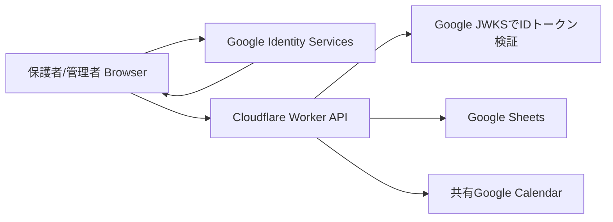

# Architecture

## Request Flow

## Why Cloudflare Workers

- Low operational cost
- No always-on server
- Same-origin static app and API
- Secrets can stay outside the public repository
- Google Sheets and Calendar calls are kept server-side

## Data Ownership

- `Members`: 管理者が管理
- `Activities`: 管理者が管理
- `Responses`: 保護者が自分の紐づく選手分だけ更新
- `ActivityComments`: ログイン済み保護者/管理者が活動単位で投稿

