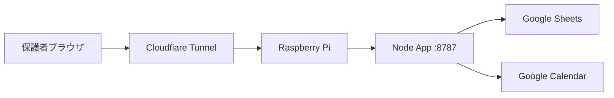

# Raspberry Pi運用ガイド

Raspberry Piを一時的な本番サーバーとして使えます。推奨は、Pi上でDocker Composeを動かし、外部公開はCloudflare Tunnelなどのトンネル経由にする構成です。

## 推奨構成



## 直接ポート開放を避ける理由

- 自宅回線のIP変更やルーター設定に左右される
- HTTPS証明書、攻撃対策、ログ監視を自前で持つ必要がある
- 家庭内ネットワークを公開インターネットに近づけてしまう

Cloudflare TunnelやTailscale Funnelのようなトンネルを使うと、Piに直接インバウンドポートを開けずにHTTPS公開できます。

## 必要なもの

- Raspberry Pi 4以降推奨
- Raspberry Pi OS 64-bit推奨
- Docker
- Docker Compose plugin
- Google OAuth Client ID
- Google Service Account
- Google Sheets ID
- 共有Google Calendar ID

## セットアップ

### 1. リポジトリ取得

```bash
git clone https://github.com/kaita/red-bisons-activity.git
cd red-bisons-activity
```

### 2. 環境変数

```bash
cp .env.example .env
```

`.env` に本番値を入れます。このファイルはGit管理しません。

必要な値:

- `GOOGLE_CLIENT_ID`
- `GOOGLE_SERVICE_ACCOUNT_EMAIL`
- `GOOGLE_PRIVATE_KEY`
- `SHEET_ID`
- `CALENDAR_ID`
- `ADMIN_EMAILS`
- `ALLOWED_ORIGINS`

`ALLOWED_ORIGINS` には、実際に公開するHTTPS URLを入れます。

`GOOGLE_PRIVATE_KEY` は、改行を `\n` にした1行文字列で入れてください。

### 3. Docker起動

```bash
cp docker-compose.example.yml docker-compose.yml
docker compose up -d --build
```

ローカル確認:

```bash
curl http://localhost:8787/api/config
```

### 4. Google OAuth設定

Google Cloud ConsoleのOAuth Clientで、公開URLをAuthorized JavaScript originsに追加します。

例:

```text
https://red-bisons.example.com
```

## Cloudflare Tunnel例

DNSとTunnelはCloudflare側の操作が必要です。Pi上では `cloudflared` を常駐させ、公開ホスト名を `http://localhost:8787` に向けます。

設定イメージ:

```text
Public hostname: red-bisons.example.com
Service: http://localhost:8787
```

## 運用

### 更新

```bash
git pull
docker compose up -d --build
```

### ログ確認

```bash
docker compose logs -f app
```

### 停止

```bash
docker compose down
```

## クラウド移行

Pi運用からクラウドへ移すときは、以下を移すだけで済むようにしています。

- 環境変数
- Google OAuthのAuthorized JavaScript origins
- Google Sheets/CalendarのService Account共有
- DNS

アプリコードとSheetsスキーマは共通です。

## 注意点

- PiのSDカードは壊れやすいので、設定ファイルのバックアップを取る
- 停電や家庭内ネットワーク障害で止まる
- `.env` は絶対にGitHubへpushしない
- Google Service Accountの秘密鍵は、不要になったらGoogle Cloud側で削除する
